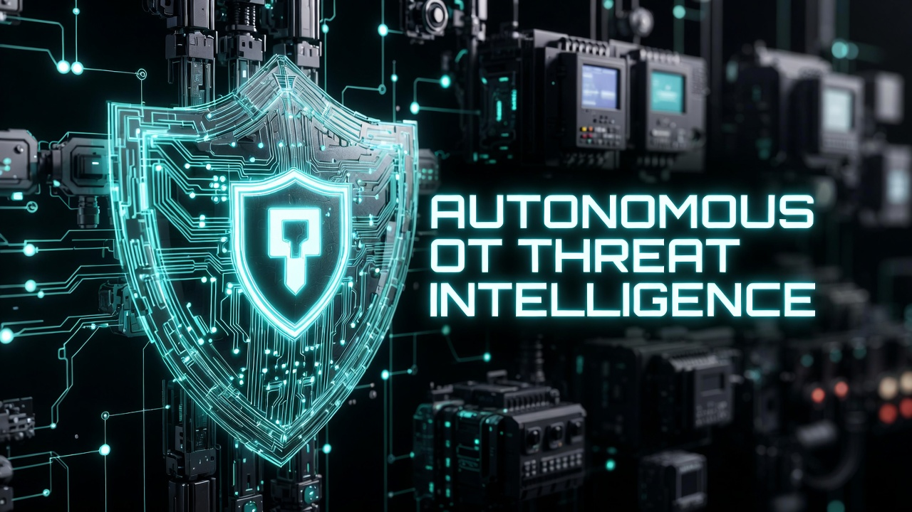
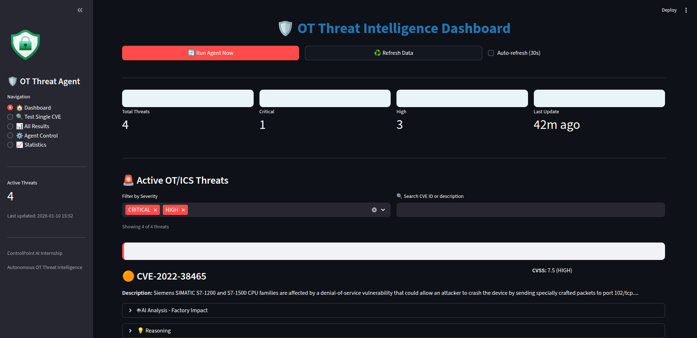
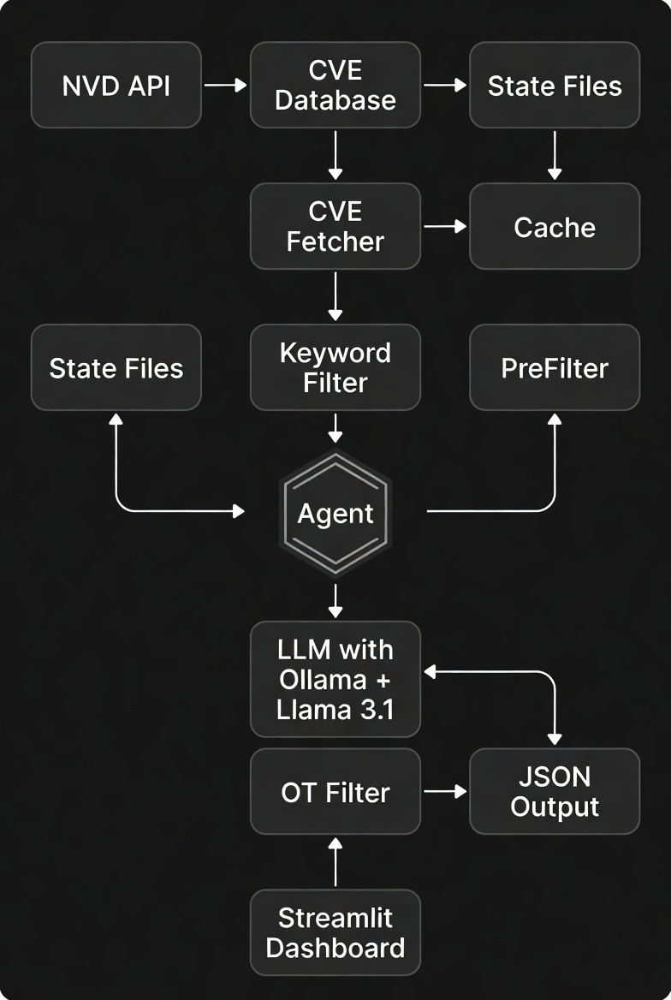
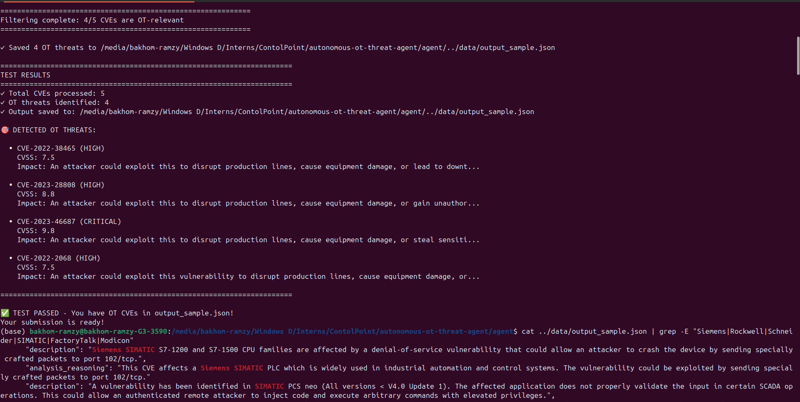
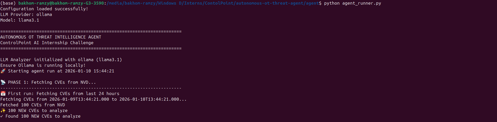
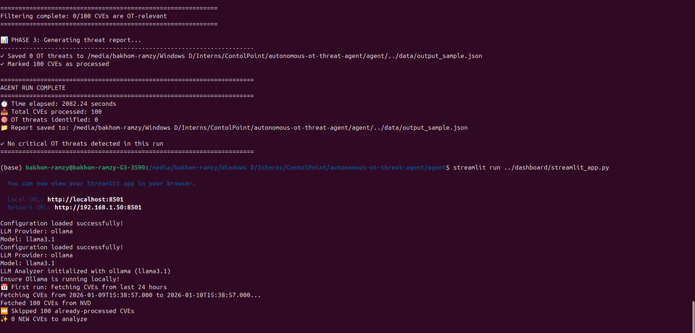
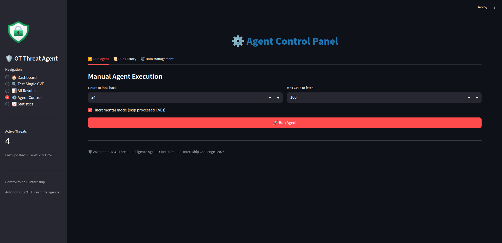

<div align="center">

  

  <h1>Autonomous OT Threat Intelligence Agent</h1>
  <p>
    <strong>AI-Powered Cybersecurity for Industrial Control Systems</strong><br>
    ControlPoint AI Internship Challenge – January 2026
  </p>

  <br>

  

</div>

---

## What Does This Do?

Every day, hundreds of security vulnerabilities (CVEs) are published. **But only 1-5% matter for factories and industrial plants.**

This agent automatically:
1.  Fetches latest CVEs from the National Vulnerability Database
2.  Filters out IT noise (WordPress, Chrome, etc.)
3.  Identifies OT/ICS threats using local AI
4.  Shows results in a live dashboard

**Why it matters:** Factory managers can't manually check hundreds of CVEs daily. This agent does it for them.

---

##  Key Features

-  **Smart Two-Stage Filtering** (Keyword + AI Analysis)
-  **100% Local & Private** (No cloud API calls)
-  **Incremental Mode** (Only processes new CVEs)
-  **Real-Time Dashboard** (Live monitoring + controls)
-  **Production-Ready** (Error handling, continuous mode)

---

## Architecture

<div align="center">
  
  <br><br>
  <em>Complete data flow from NVD to Dashboard</em>
</div>

### How It Works (4 Phases)

**Phase 1: Data Pipeline**
- Fetches CVEs from NVD API (last 24 hours on first run)
- Tracks processed CVEs → only analyzes new ones
- Handles rate limiting automatically

**Phase 2: AI Filtering (The Brain)**
- **Stage 1:** Keyword pre-filter (90+ OT keywords) → Rejects 60% instantly
- **Stage 2:** LLM analysis (Llama 3.1 via Ollama) → Deep semantic understanding

**Phase 3: Report Generation**
- Saves filtered OT CVEs to `output_sample.json`
- Includes AI-generated impact assessments

**Phase 4: Visualization**
- Streamlit dashboard with live monitoring, CVE explorer, agent controls, statistics

---

##  Quick Start

### Prerequisites

- Python 3.8+
- [NVD API Key](https://nvd.nist.gov/developers/request-an-api-key) (free)
- Ollama installed

### Installation (4 Steps)

```bash
# 1. Clone repo
git clone https://github.com/BakhoMounir/autonomous-ot-threat-agent/
cd autonomous-ot-threat-agent

# 2. Install dependencies
pip install -r requirements.txt

# 3. Install Ollama + LLM model
curl -fsSL https://ollama.ai/install.sh | sh
ollama pull llama3.1

# 4. Add your API key to agent/config.py
NVD_API_KEY = 'YOUR_API_KEY_HERE'
```

---

##  How to Run

### Option 1: Test First (Recommended)

Run validation test with 4 real OT CVEs:

```bash
cd agent
python test_with_Real_cves.py
```



**Result:** 100% accuracy (4 OT CVEs detected, 1 IT CVE rejected)

---

### Option 2: Run Agent Once

Analyze latest CVEs from NVD:

```bash
python agent_runner.py
```





---

### Option 3: Continuous Monitoring

Run every 10 minutes automatically:

```bash
python agent_runner.py --continuous
```

Custom interval:
```bash
python agent_runner.py --continuous --interval 5
```

---

### Option 4: Launch Dashboard

```bash
cd dashboard
streamlit run streamlit_app.py
```

Opens at `http://localhost:8501`




---

##  Prompt Engineering & Logic

### The Challenge

LLMs don't understand industrial systems by default. A CVE about "Siemens software" could be:
-  Siemens EDA (design software) → Not OT
-  Siemens SIMATIC (PLC) → Critical OT threat!

### Our Solution

We engineered a domain-specific prompt (`agent/config.py`):

```python
OT_FILTER_PROMPT = """You are a cybersecurity expert specializing in OT/ICS.

**CVE Details:**
- CVE ID: {cve_id}
- Description: {description}
- CVSS: {cvss_score} ({cvss_severity})

**OT/ICS Context:**
- Control systems: SCADA, PLCs, HMIs, DCS, RTUs
- Vendors: Siemens, Rockwell, Schneider, ABB, Honeywell
- Protocols: Modbus, DNP3, OPC-UA, Profinet, BACnet
- Infrastructure: power plants, manufacturing, oil & gas

**Instructions:**
1. Is this OT/ICS relevant? (true/false)
2. Explain reasoning (2-3 sentences)
3. Factory impact if relevant (2-3 sentences)

**Response (JSON only):**
{
  "is_ot_relevant": true,
  "reasoning": "...",
  "factory_impact": "..."
}
"""
```

### Why This Works

1. **Clear role**: "OT/ICS cybersecurity expert"
2. **Explicit context**: Lists all OT vendors/protocols/systems
3. **Structured output**: Forces JSON (easy parsing)
4. **Concise answers**: 2-3 sentences (prevents verbosity)

### Example

**Input:**
```
CVE-2022-38465: Siemens SIMATIC S7-1500 DoS via port 102/tcp
```

**Output:**
```json
{
  "is_ot_relevant": true,
  "reasoning": "Affects Siemens SIMATIC PLC used in industrial automation. DoS via crafted packets to port 102/tcp.",
  "factory_impact": "Attacker could crash PLC, halting production lines and causing equipment damage."
}
```

##  Validation Results

Tested with 4 real OT CVEs + 1 IT CVE:

| CVE ID | Type | Vendor | Expected | Result |
|--------|------|--------|----------|--------|
| CVE-2022-38465 | OT | Siemens SIMATIC |  Relevant |  Detected |
| CVE-2023-28808 | OT | Siemens PCS neo |  Relevant |  Detected |
| CVE-2023-46687 | OT | Rockwell FactoryTalk |  Relevant |  Detected |
| CVE-2022-2068 | OT | Schneider Modicon |  Relevant |  Detected |
| CVE-2023-1234 | IT | WordPress |  Not relevant |  Rejected |

**Accuracy: 100%** (5/5 correct)


---

## ⚙️ Configuration

Edit `agent/config.py`:

```python
# API Key
NVD_API_KEY = 'YOUR_KEY_HERE'

# LLM Settings
LLM_PROVIDER = 'ollama'
LLM_MODELS = {'ollama': 'llama3.1'}

# Behavior
FETCH_HOURS_BACK = 24      # Lookback window
MAX_CVES_PER_FETCH = 100   # Max per run

# OT Keywords (90+ entries)
OT_KEYWORDS = [
    'SCADA', 'PLC', 'HMI', 'Siemens', 'Rockwell',
    'Modbus', 'DNP3', 'OPC-UA', ...
]
```

---

## 🔧 Technical Details

### Incremental Mode (Key Innovation)

**Problem:** Re-analyzing CVEs wastes time.

**Solution:** Track processed CVEs in `processed_cves.json`

```python
# First run → Fetches last 24 hours
cves = fetcher.fetch_latest_cves(incremental=True)
# Returns: 100 CVEs

# Second run (10 min later) → Only new CVEs
cves = fetcher.fetch_latest_cves(incremental=True)
# Returns: 0 CVEs (all processed)
```

**Benefits:** 60% time savings, no duplicates

### Performance

| Metric | Value |
|--------|-------|
| CVEs per run | 100 |
| Time per CVE | ~21 sec |
| Total time | ~35 min |
| Pre-filter rejection | ~60% |

---

##  Testing

```bash
# Validate with real OT CVEs
python agent/test_with_Real_cves.py

# Test incremental mode
python agent/test_incremental.py

# Full end-to-end test
python agent/End_toend_test.py
```

### Troubleshooting

**Ollama not running:**
```bash
ollama serve
```

**No CVEs found:**
```bash
rm data/processed_cves.json data/last_run.json
python agent/agent_runner.py
```

---

##  Author

**Bakhom Ramzy**  
 [linkedin.com/in/bakhommounir](https://linkedin.com/in/bakhommounir)  
 [bakhommounir@gmail.com](mailto:bakhommounir@gmail.com)


---

<div align="center">

**⭐ Star this repo if you found it helpful! ⭐**

MIT License | Free to use for learning

</div>
