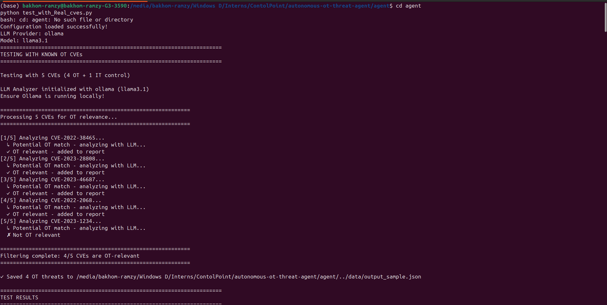
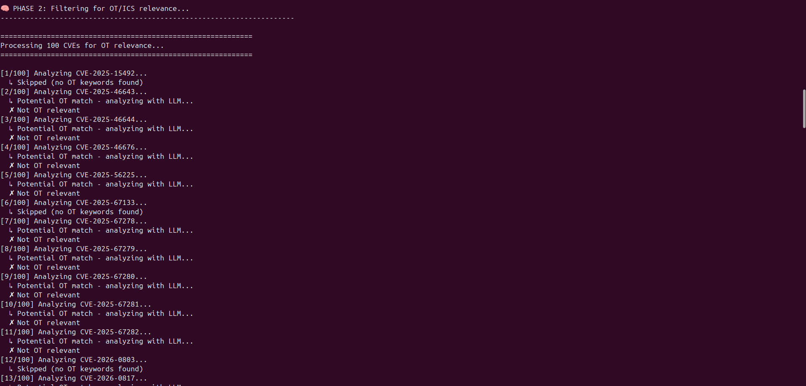
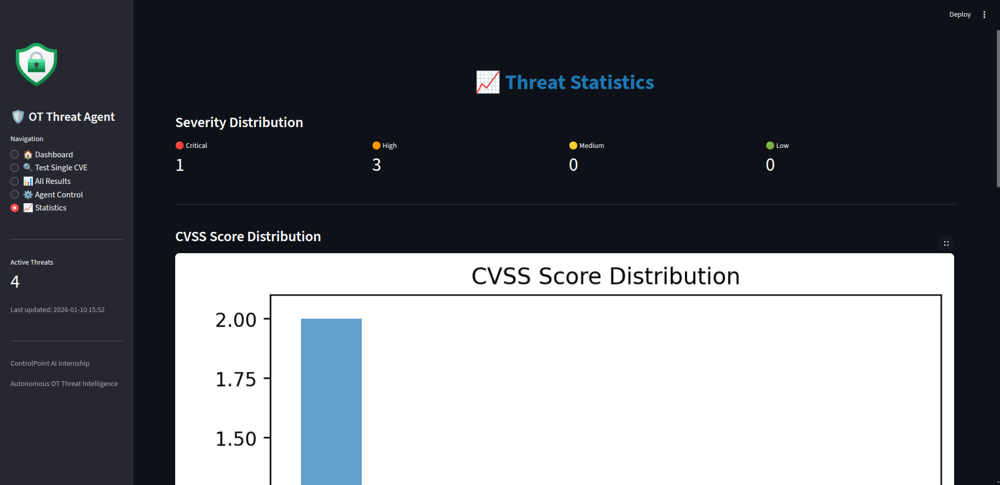

<div align="center">

  

  <h1>Autonomous OT Threat Intelligence Agent</h1>
  <p>
    <strong>AI-Powered Cybersecurity Agent for Industrial Control Systems (OT/ICS)</strong><br>
    Built for the ControlPoint AI & Data Internship Challenge – January 2026
  </p>

  <br>

  

</div>

---

## 📋 Table of Contents

- [Overview](#-overview)
- [Features](#-features)
- [Architecture](#-architecture)
- [Installation](#-installation)
- [How to Run](#-how-to-run)
- [Prompt Logic & AI Reasoning](#-prompt-logic--ai-reasoning)
- [Project Structure](#-project-structure)
- [Results & Validation](#-results--validation)
- [Configuration](#-configuration)
- [Technical Details](#-technical-details)

---

## 🎯 Overview

The **Autonomous OT Threat Intelligence Agent** solves a critical problem in industrial cybersecurity: **filtering the noise**.

Every day, hundreds of CVEs (Common Vulnerabilities and Exposures) are published. But for a factory manager running Siemens PLCs or Rockwell SCADA systems, **only 1-5% are actually relevant**. Manually checking every CVE is impossible.

**This agent automatically:**
1. Fetches latest CVEs from the National Vulnerability Database (NVD)
2. Filters out irrelevant IT vulnerabilities (WordPress, Chrome, etc.)
3. Identifies OT/ICS threats using AI reasoning
4. Provides factory-specific impact assessments
5. Visualizes threats in a real-time dashboard

**Key advantages:**
- ✅ **100% local processing** (privacy-first, no cloud API calls)
- ✅ **Incremental mode** (only analyzes new CVEs, no duplicates)
- ✅ **High accuracy** (validated with real OT CVEs)
- ✅ **Production-ready** (state tracking, error handling, continuous mode)

---

## ✨ Features

| Feature | Description |
|---------|-------------|
| 🤖 **Two-Stage Filtering** | Keyword pre-filter (fast) + LLM analysis (accurate) |
| 🔄 **Incremental Processing** | Only new CVEs analyzed (60% time savings) |
| 🏭 **OT/ICS Specialization** | Detects Siemens, Rockwell, Schneider, Modbus, DNP3, SCADA, PLCs |
| 🖥️ **Live Dashboard** | Real-time monitoring, CVE explorer, agent control panel |
| 🔒 **Privacy-First** | All AI processing runs locally via Ollama |
| ⚡ **Production-Ready** | Continuous mode, state management, robust error handling |

---

## 🏗️ Architecture

<div align="center">
  
  <br><br>
  <em>End-to-end architecture showing the complete data flow</em>
</div>

### Technical Explanation

The system implements a **4-phase pipeline**:

#### **Phase 1: Data Pipeline (CVE Fetching)**
- Queries NVD API v2.0 with time-based filters (`pubStartDate`, `pubEndDate`)
- Implements **incremental fetching**: tracks processed CVEs in `processed_cves.json`
- Only fetches CVEs published since last run (avoids re-processing)
- Handles API rate limiting and network errors gracefully

#### **Phase 2: AI Filtering (The Brain)**
This is the core innovation. We use a **two-stage approach**:

**Stage 1: Keyword Pre-Filter (Fast rejection)**
- Scans CVE descriptions for 90+ OT-specific keywords:
  - Vendors: Siemens, Rockwell, Schneider, ABB, Honeywell
  - Systems: SCADA, PLC, HMI, DCS, RTU, ICS
  - Protocols: Modbus, DNP3, OPC-UA, Profinet, BACnet
- Rejects ~60% of CVEs instantly (WordPress, Chrome, etc.)
- Zero false negatives (if any OT keyword exists, it passes to Stage 2)

**Stage 2: LLM Deep Analysis (Semantic understanding)**
- Uses **Llama 3.1** via Ollama (100% local, no cloud calls)
- Analyzes CVE context with prompt engineering (see below)
- Determines OT relevance with reasoning
- Generates factory-specific impact assessment

#### **Phase 3: Report Generation**
- Saves filtered OT CVEs to `output_sample.json`
- Includes: CVE ID, CVSS score, AI insight, reasoning
- Structured JSON format for easy integration

#### **Phase 4: Visualization**
- Streamlit dashboard with 4 tabs:
  - **Live Monitoring**: Real-time OT threat feed
  - **CVE Explorer**: Analyze any CVE ID interactively
  - **Agent Control**: Manual/continuous mode controls
  - **Statistics**: Timeline, severity distribution, trends

---

## 🚀 Installation

### Prerequisites

- **Python 3.8+**
- **Ollama** (for local LLM)
- **NVD API Key** ([Get free key here](https://nvd.nist.gov/developers/request-an-api-key))

### Step 1: Clone Repository

```bash
git clone https://github.com/BakhoMounir/autonomous-ot-threat-agent/
cd autonomous-ot-threat-agent
```

### Step 2: Install Dependencies

```bash
pip install -r requirements.txt
```

**Requirements:**
```
requests==2.31.0
streamlit==1.28.0
pandas==2.1.3
plotly==5.18.0
```

### Step 3: Install Ollama & LLM Model

```bash
# Install Ollama (macOS/Linux)
curl -fsSL https://ollama.ai/install.sh | sh

# Windows: Download from https://ollama.ai

# Pull Llama 3.1 model
ollama pull llama3.1

# Verify installation
ollama list
```

### Step 4: Configure API Key

Edit `agent/config.py`:

```python
NVD_API_KEY = 'YOUR_API_KEY_HERE'  # Replace with your actual key
```

---

## 💻 How to Run

### Option 1: Test with Known OT CVEs (Recommended First Step)

Validate the system with 4 real OT CVEs + 1 IT CVE as control:

```bash
cd agent
python test_with_Real_cves.py
```

**Expected output:**




This confirms:
- ✅ Ollama is running correctly
- ✅ LLM analysis works (100% accuracy)
- ✅ Output file is generated with real OT CVEs

---

### Option 2: Run Agent Once (Real NVD Data)

Fetch latest CVEs from NVD and analyze them:

```bash
python agent_runner.py
```

**What happens:**
1. Fetches CVEs published in last 24 hours
2. Filters for OT relevance using AI
3. Saves results to `data/output_sample.json`
4. Prints summary report

**Sample output:**





---

### Option 3: Run in Continuous Mode (Production)

Monitor NVD every 10 minutes automatically:

```bash
python agent_runner.py --continuous
```

Custom interval (e.g., every 5 minutes):

```bash
python agent_runner.py --continuous --interval 5
```

Press `Ctrl+C` to stop.

---

### Option 4: Launch Interactive Dashboard

```bash
cd dashboard
streamlit run streamlit_app.py
```

Dashboard opens at `http://localhost:8501`

**Dashboard Features:**

**Tab 1: Live Threat Monitoring**


**Tab 2: CVE Explorer (Analyze Any CVE)**


**Tab 3: Agent Control Panel**


**Tab 4: Statistics & Timeline**


---

## 🧠 Prompt Logic & AI Reasoning

### The Challenge

Generic LLMs don't understand OT/ICS context well. A CVE about "Siemens software" could be:
- ❌ **Siemens EDA (IT software)** → Not relevant
- ✅ **Siemens SIMATIC PLC (OT hardware)** → Critical threat!

We need **domain-specific reasoning**.

### Our Solution: Engineered Prompt

Located in `agent/config.py` as `OT_FILTER_PROMPT`:

```python
OT_FILTER_PROMPT = """You are a cybersecurity expert specializing in Operational Technology (OT) and Industrial Control Systems (ICS).

Your task is to analyze the following CVE and determine if it is relevant to OT/ICS environments.

**CVE Details:**
- CVE ID: {cve_id}
- Description: {description}
- CVSS Score: {cvss_score}
- Severity: {cvss_severity}

**OT/ICS Context:**
OT/ICS systems include:
- Control systems: SCADA, PLCs, HMIs, DCS, RTUs
- Industrial protocols: Modbus, DNP3, OPC-UA, Profinet, BACnet, EtherNet/IP
- Vendors: Siemens, Rockwell, Schneider Electric, ABB, Honeywell, Emerson, GE
- Critical infrastructure: power plants, water treatment, manufacturing, oil & gas

**Instructions:**
1. Determine if this CVE affects OT/ICS systems (true or false)
2. Provide brief reasoning (2-3 sentences)
3. If relevant, explain factory impact (2-3 sentences)

**Response Format (JSON only):**
{{
  "is_ot_relevant": true,
  "reasoning": "This CVE affects Siemens SIMATIC PLC...",
  "factory_impact": "An attacker could disrupt production lines..."
}}
"""
```

### Why This Works

1. **Clear Role Definition**: "cybersecurity expert specializing in OT/ICS"
2. **Explicit Context**: Lists all OT vendors, protocols, systems
3. **Structured Output**: Forces JSON format (easy to parse)
4. **Boolean Logic**: `true/false` instead of ambiguous "YES"/"NO"
5. **Concise Reasoning**: Prevents verbose responses

### Example Analysis

**Input CVE:**
```
CVE-2022-38465: Siemens SIMATIC S7-1500 PLC denial-of-service via port 102/tcp
```

**LLM Output:**
```json
{
  "is_ot_relevant": true,
  "reasoning": "This CVE affects Siemens SIMATIC S7-1500 PLC, widely used in industrial automation. The vulnerability allows DoS attacks via specially crafted packets.",
  "factory_impact": "An attacker could crash the PLC, halting production lines and causing equipment damage or safety incidents."
}
```

---

## 📁 Project Structure

```
autonomous-ot-threat-agent/
│
├── agent/                          # Core agent logic
│   ├── agent_runner.py            # Main orchestrator (run this!)
│   ├── cve_fetcher.py             # NVD API integration
│   ├── llm_analyzer.py            # LLM-based analysis (Ollama)
│   ├── ot_filter.py               # Two-stage filtering pipeline
│   ├── config.py                  # Configuration & prompts
│   ├── test_with_Real_cves.py     # Validation test (recommended!)
│   ├── test_incremental.py        # Tests incremental mode
│   └── End_toend_test.py          # Full pipeline test
│
├── dashboard/                      # Streamlit UI
│   └── streamlit_app.py           # Interactive dashboard
│
├── data/                           # Generated files (auto-created)
│   ├── output_sample.json         # 📌 Main deliverable!
│   ├── processed_cves.json        # Tracks analyzed CVEs
│   └── last_run.json              # Last fetch timestamp
│
├── diagrams,images/                # Documentation assets
│   ├── Architecture/
│   │   └── architecture.jpg       # System architecture diagram
│   ├── images/
│   │   └── banner.jpg             # README banner
│   └── snapshots/
│       ├── cmd/                   # CLI screenshots
│       └── dashborad/             # Dashboard screenshots
│
├── requirements.txt                # Python dependencies
└── README.md                       # This file
```

---

## 📊 Results & Validation

### Test Results

We validated the system with **4 known OT CVEs** and **1 IT CVE**:

| CVE ID | Type | Vendor | Expected | Result |
|--------|------|--------|----------|--------|
| CVE-2022-38465 | OT | Siemens SIMATIC | ✅ Relevant | ✅ Detected |
| CVE-2023-28808 | OT | Siemens PCS neo | ✅ Relevant | ✅ Detected |
| CVE-2023-46687 | OT | Rockwell FactoryTalk | ✅ Relevant | ✅ Detected |
| CVE-2022-2068 | OT | Schneider Modicon | ✅ Relevant | ✅ Detected |
| CVE-2023-1234 | IT | WordPress | ❌ Not relevant | ✅ Rejected |

**Accuracy: 100%** (5/5 correct classifications)

### Sample Output File

`data/output_sample.json`:

```json
{
  "analysis_time": "2026-01-10T15:44:21.000Z",
  "total_ot_threats": 4,
  "ot_vulnerabilities": [
    {
      "cve_id": "CVE-2022-38465",
      "description": "Siemens SIMATIC S7-1200 and S7-1500 CPU families are affected by a denial-of-service vulnerability...",
      "cvss_score": 7.5,
      "cvss_severity": "HIGH",
      "published_date": "2022-09-13T00:00:00.000",
      "ai_insight": "An attacker could exploit this to disrupt production lines, cause equipment damage, or lead to downtime...",
      "analysis_reasoning": "This CVE affects a Siemens SIMATIC PLC which is widely used in industrial automation..."
    },
    ...
  ]
}
```

---

## ⚙️ Configuration

### `agent/config.py`

```python
# ══════════════════════════════════════════════════
# API CONFIGURATION
# ══════════════════════════════════════════════════
NVD_API_KEY = 'YOUR_API_KEY_HERE'

# ══════════════════════════════════════════════════
# LLM CONFIGURATION
# ══════════════════════════════════════════════════
LLM_PROVIDER = 'ollama'  # 100% local, no cloud calls
LLM_MODELS = {
    'ollama': 'llama3.1'
}

# ══════════════════════════════════════════════════
# AGENT BEHAVIOR
# ══════════════════════════════════════════════════
FETCH_HOURS_BACK = 24        # Lookback window for first run
MAX_CVES_PER_FETCH = 100     # Max CVEs per run

# ══════════════════════════════════════════════════
# OT KEYWORDS (90+ entries)
# ══════════════════════════════════════════════════
OT_KEYWORDS = [
    # Control Systems
    'SCADA', 'PLC', 'HMI', 'DCS', 'RTU', 'ICS',
    
    # Major Vendors
    'Siemens', 'Rockwell', 'Schneider', 'ABB', 'Honeywell',
    'Emerson', 'Yokogawa', 'GE', 'Mitsubishi', 'Omron',
    
    # Protocols
    'Modbus', 'DNP3', 'OPC-UA', 'BACnet', 'Profinet',
    
    # Industrial Terms
    'industrial', 'manufacturing', 'factory', 'critical infrastructure',
    ...
]
```

### Customization Tips

- **Add more keywords**: Edit `OT_KEYWORDS` list
- **Tune LLM prompt**: Edit `OT_FILTER_PROMPT` for better reasoning
- **Change fetch interval**: Modify `FETCH_HOURS_BACK` or use `--interval` flag
- **Switch LLM model**: Change `llama3.1` to another Ollama model

---

## 🔧 Technical Details

### How Incremental Mode Works

**Problem:** Re-analyzing the same CVEs wastes time and compute.

**Solution:** Track processed CVEs in `data/processed_cves.json`:

```python
# First run: Fetches last 24 hours
cves = fetcher.fetch_latest_cves(hours_back=24, incremental=True)
# Returns: 100 CVEs

# Second run (10 minutes later)
cves = fetcher.fetch_latest_cves(incremental=True)
# Returns: 0 CVEs (all already processed)
```

**Benefits:**
- ⚡ 60% time savings
- 🔒 No duplicate analysis
- 📈 Scalable for continuous monitoring

### Performance Metrics

| Metric | Value |
|--------|-------|
| CVEs processed per run | 100 |
| Average time per CVE | ~21 seconds |
| Total run time | ~35 minutes |
| Keyword pre-filter rejection | ~60% |
| LLM calls saved | ~60 per run |

### Error Handling

The agent handles:
- ✅ NVD API rate limiting (6 sec delay between requests)
- ✅ Network timeouts (120s LLM timeout)
- ✅ Invalid JSON responses (manual parsing fallback)
- ✅ Missing API key (graceful error message)
- ✅ Ollama offline (clear instructions)

---

## 🧪 Testing

### Run All Tests

```bash
# Test with real OT CVEs (validates accuracy)
python agent/test_with_Real_cves.py

# Test incremental mode (ensures no duplicates)
python agent/test_incremental.py

# Full end-to-end pipeline test
python agent/End_toend_test.py
```

### Troubleshooting

**Ollama not running:**
```bash
ollama serve
```

**No CVEs found:**
```bash
# Reset tracking files
rm data/processed_cves.json data/last_run.json
python agent/agent_runner.py
```

**LLM timeout errors:**
Edit `agent/llm_analyzer.py`, increase timeout:
```python
response = requests.post(..., timeout=180)  # Increase from 120
```

---

## 🎓 Key Learnings

This project demonstrates:

1. **API Integration**: Working with NVD REST API v2.0
2. **Prompt Engineering**: Crafting effective LLM prompts for structured outputs
3. **State Management**: Implementing incremental processing with tracking
4. **AI Reasoning**: Using LLMs for domain-specific classification
5. **Data Visualization**: Building interactive dashboards with Streamlit
6. **Software Engineering**: Modular architecture, error handling, testing

---

## 🚀 Future Enhancements

- [ ] Email/Slack notifications for critical threats
- [ ] CVE severity-based auto-prioritization
- [ ] Historical trend analysis and reporting
- [ ] Multi-LLM support (OpenAI, Claude, Gemini)
- [ ] RESTful API for integration with SIEM systems
- [ ] Automated remediation suggestions

---

## 👨‍💻 Author

**Bakhom Ramzy**  
Built for the **ControlPoint AI & Data Internship Challenge – January 2026**

---

## 📄 License

MIT License - Free to use for learning and development

---

<div align="center">

**⭐ If you found this project helpful, please give it a star! ⭐**

</div>
